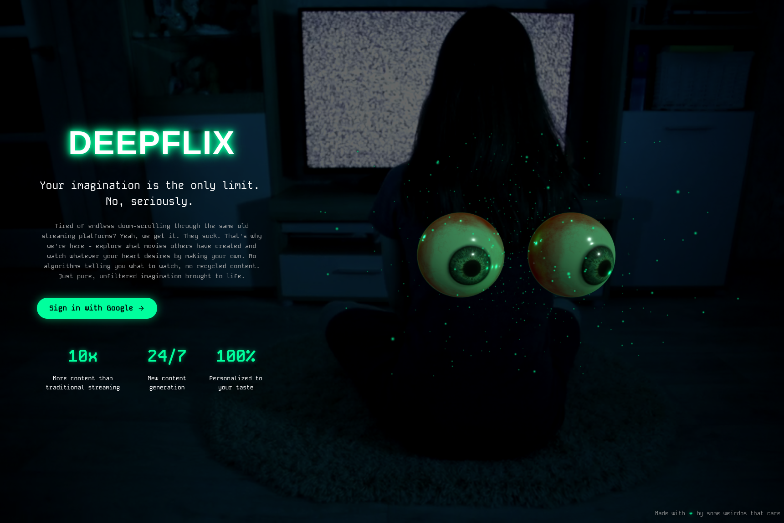
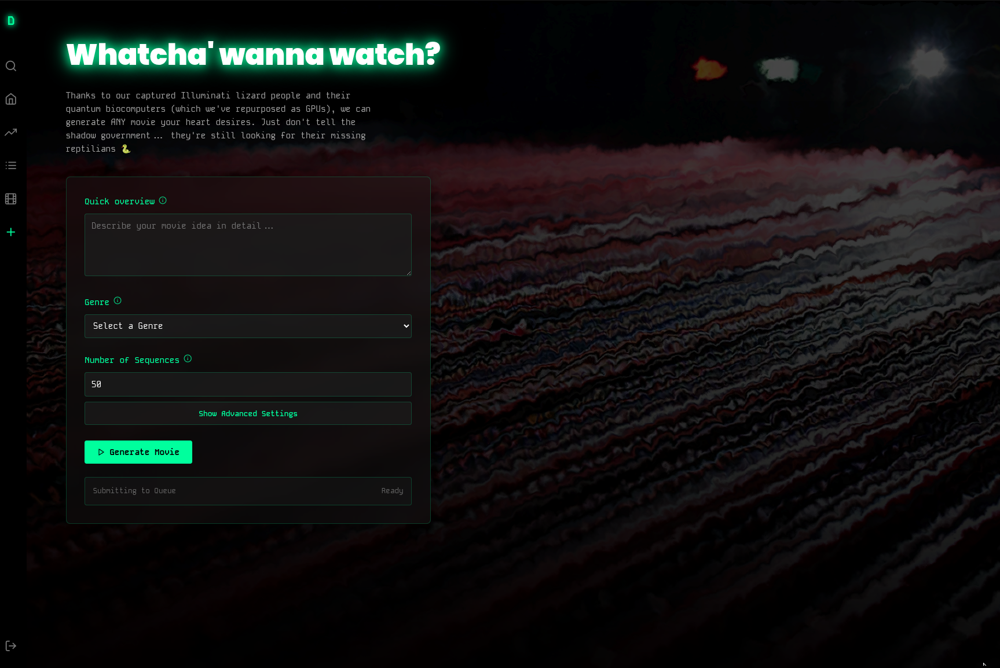
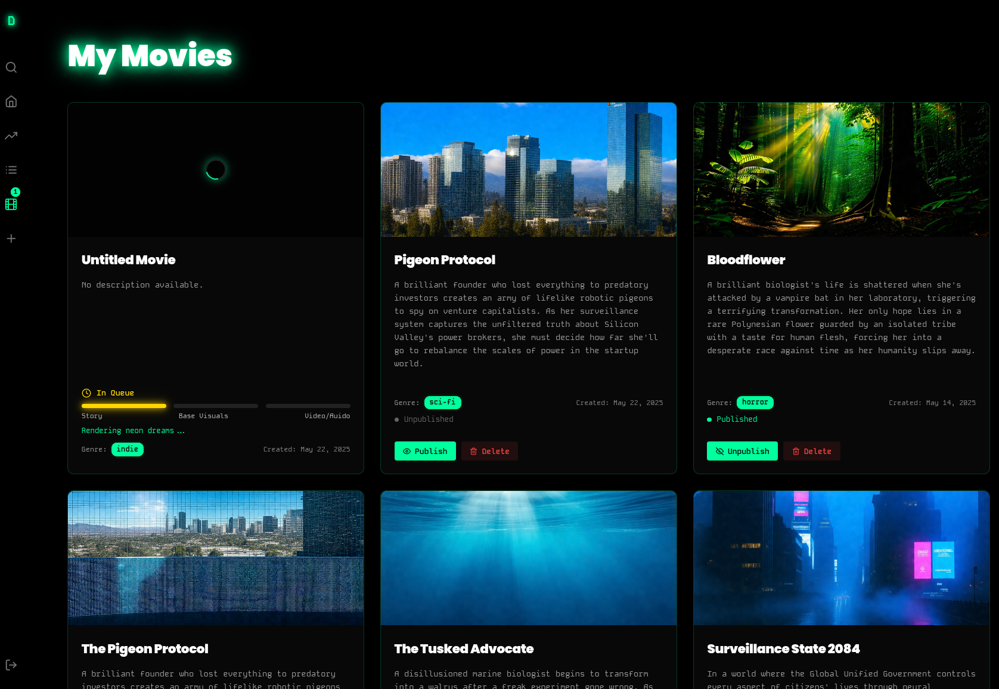

# DeepFlix UI

## Overview
DeepFlix is a React-based application that allows users to browse, create, and manage movies. It features a dynamic UI with animated backgrounds, real-time updates, and integration with Firebase for authentication and data storage.






## Features
- **Home Page**: Displays featured content and trending movies.
- **Movies Page**: Lists all available movies.
- **Create Page**: Allows users to create new movies.
- **My Movies Page**: Shows user-specific movies with real-time updates.
- **Roadmap Page**: Displays a visual roadmap of the project's future plans.
- **Navigation**: A fixed sidebar for easy access to different sections of the app.

## Architecture
The app is structured as follows:

```
src/
├── components/       # Reusable UI components
│   ├── Nav.js
│   ├── RoadmapBackground.js
│   └── TrendingRow.js
├── pages/            # Full pages/routes
│   ├── Home.js
│   ├── Movies.js
│   ├── Create.js
│   ├── MyMovies.js
│   └── Roadmap.js
├── App.js            # Main application component
├── firebase.js       # Firebase configuration
└── AuthContext.js    # Authentication context
```

## How It Works
1. **User Authentication**: Users log in via Firebase Authentication.
2. **Data Management**: Movie data is stored in Firebase Firestore.
3. **Real-Time Updates**: Active jobs and movie statuses are updated in real-time using Firestore listeners.
4. **UI Components**: The app uses styled-components for styling and Framer Motion for animations.

## Diagrams
### User Flow


### Data Flow


### Queue Service Flow


## Queue Service Integration
DeepFlix communicates with a Queue Service to process movie creation requests. The Queue Service is responsible for handling asynchronous tasks such as video processing and data updates.

### How It Works
- **API Endpoint**: The app sends requests to the Queue Service via the `REACT_APP_QUEUE_API_URL` environment variable.
- **Asynchronous Processing**: When a user creates a movie, the request is sent to the Queue Service, which processes it in the background.
- **Real-Time Updates**: The app listens for updates from the Queue Service to reflect the status of movie processing in real-time.

### Example Flow


## Setup Instructions
1. Clone the repository.
2. Install dependencies:
   ```bash
   npm install
   ```
3. Set up environment variables in a `.env` file:
   ```
   REACT_APP_FIREBASE_API_KEY=your_api_key
   REACT_APP_FIREBASE_AUTH_DOMAIN=your_auth_domain
   REACT_APP_FIREBASE_PROJECT_ID=your_project_id
   REACT_APP_FIREBASE_STORAGE_BUCKET=your_storage_bucket
   REACT_APP_FIREBASE_MESSAGING_SENDER_ID=your_messaging_sender_id
   REACT_APP_FIREBASE_APP_ID=your_app_id
   REACT_APP_FIREBASE_MEASUREMENT_ID=your_measurement_id
   REACT_APP_SAMPLE_VIDEO_URL=your_sample_video_url
   
   REACT_APP_QUEUE_API_URL=your_queue_api_url
   ```
4. Start the development server:
   ```bash
   npm start
   ```

## Contributing
Contributions are welcome! Please open an issue or submit a pull request.

## License
This project is licensed under the MIT License.
